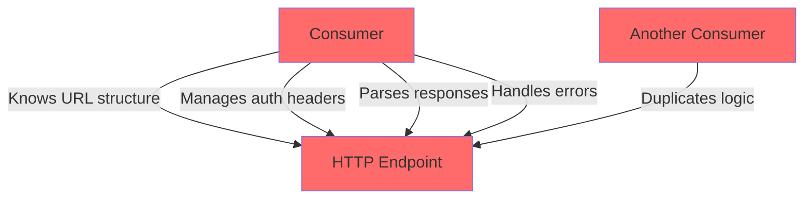
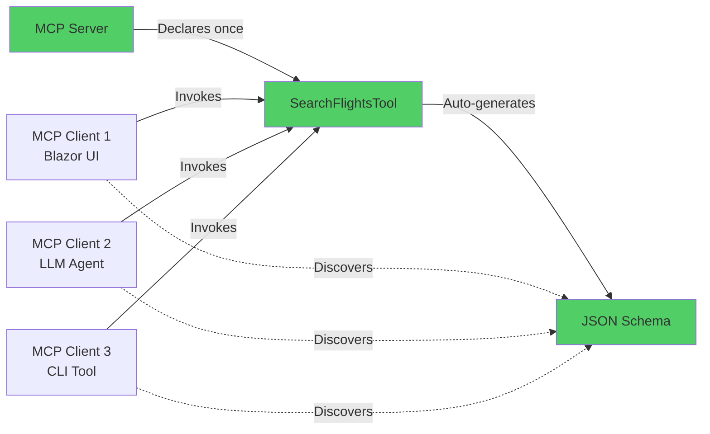
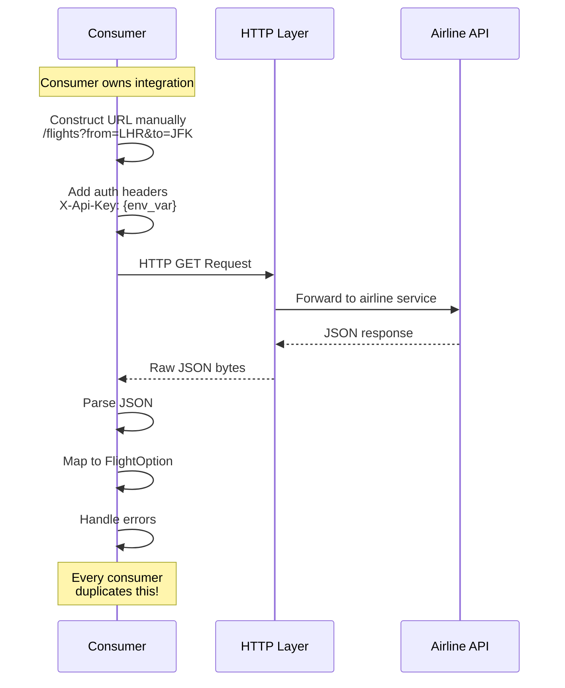
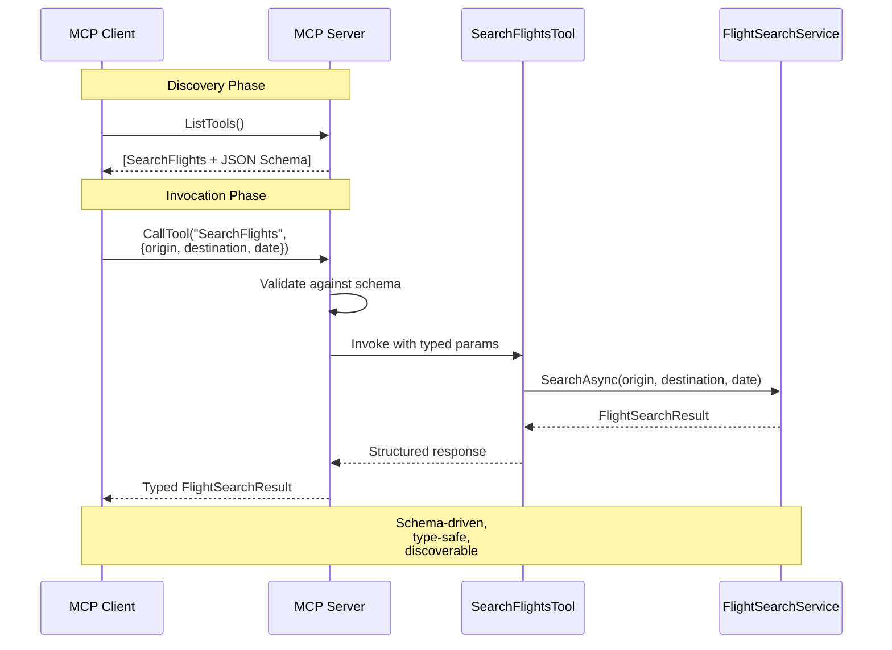
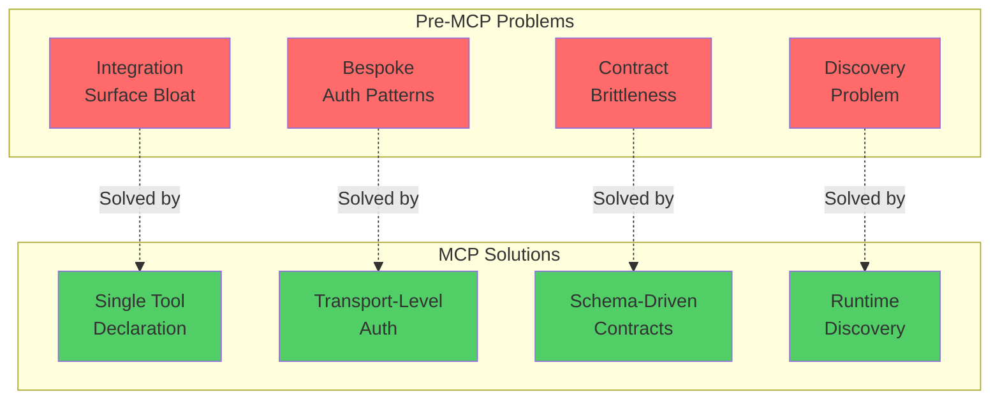

# Chapter 1: Adopt MCP on .NET - Problems, Patterns, and Payoff

## Overview

This chapter demonstrates the motivation for MCP by comparing **pre-MCP manual HTTP integration** with **MCP-based standardized integration**. It shows how MCP eliminates tight coupling, bespoke authentication, and brittle contracts through a working, runnable demonstration.

## 📁 Project Structure

```
Chapter01/code/
├── Chapter01.csproj                      # Project configuration
├── Program.cs                            # Main demonstration runner
├── Shared.cs                             # Shared domain models and interfaces
├── MockFlightSearchService.cs            # Mock service implementation
├── ch01_1_without_mcp_integration.cs     # Pre-MCP approach
└── ch01_2_with_mcp_search_flights.cs     # MCP approach
```

## 🎯 Learning Objectives

- ✅ Identify bottlenecks in current .NET architectures
- ✅ Compare pre-MCP vs MCP integration approaches
- ✅ Understand MCP tool registration and schema generation
- ✅ See how MCP standardizes capability exposure across consumers

## 📚 Code Files Explained

### Supporting Files

#### `Shared.cs` - Domain Models & Interfaces

Defines the shared types used across both pre-MCP and MCP examples:

```csharp
// Domain Models
FlightOption       - Represents a flight search result
Money              - Monetary value with currency
FlightSearchResult - Search operation result container

// Service Interface
IFlightSearchService - Contract for flight search operations
```

**Purpose**: Provides a common domain model that both approaches use, showing that **MCP doesn't change your business logic—only how you expose it**.

> **TIP**: The same `IFlightSearchService` interface works with both manual HTTP integration and MCP tools. Your service layer remains unchanged!

#### `MockFlightSearchService.cs` - Test Implementation

Implements `IFlightSearchService` with sample flight data:
- Returns 3 mock flights (British Airways, Virgin Atlantic, Lufthansa)
- No external dependencies or API calls required
- Demonstrates service layer pattern

**Purpose**: Allows the demo to run standalone without actual airline APIs, focusing purely on the integration pattern differences.

### Example Files

#### `ch01_1_without_mcp_integration.cs` - Pre-MCP Approach

**Problems Demonstrated**:



Issues with this approach:
- ❌ **Tight Coupling**: Consumer owns entire integration surface
- ❌ **Bespoke Auth**: Must know header names, env vars
- ❌ **Brittle Contracts**: URL changes break all consumers silently
- ❌ **Duplication**: Each consumer (UI, worker, LLM) duplicates logic

**Code Characteristics**:
```csharp
// Consumer must know:
✗ Header names (X-Api-Key)
✗ Environment variables (AIRLINE_API_KEY)  
✗ URL conventions (/flights?from=X&to=Y)
✗ Response mapping (AirlineApiResponse → FlightOption)
```

#### `ch01_2_with_mcp_search_flights.cs` - MCP Approach

**Benefits Demonstrated**:



Advantages:
- ✅ **Schema Auto-Generation**: From C# types + `[Description]` attributes
- ✅ **Discoverable**: Any MCP client can find and use it
- ✅ **Transport-Agnostic**: Auth handled by transport layer
- ✅ **Single Declaration**: One definition serves unlimited consumers

**Code Characteristics**:
```csharp
[McpServerToolType]
public class SearchFlightsTool {
    [McpServerTool]
    [Description("Search available flights between airports")]
    public async Task<FlightSearchResult> SearchFlightsAsync(
        [Description("IATA origin code, e.g. LHR")] string origin,
        [Description("IATA destination code, e.g. JFK")] string destination,
        [Description("Departure date (ISO 8601)")] string date,
        CancellationToken ct = default)
    {
        // Single implementation, discovered by all MCP clients
    }
}
```

## 🚀 Building and Running

### Prerequisites

- **.NET SDK 10.0.201** or later
- **Visual Studio 2022+** or .NET CLI
- **PowerShell** (recommended for SDK environment setup)

> **IMPORTANT NOTE**: This project requires .NET 10 SDK. If you encounter build errors mentioning SDK paths, see the "SDK Environment Setup" section below.

### Quick Start

```powershell
# Navigate to project directory
cd HandsOnMCPCSharp\Chapter01\code

# Build the project
dotnet build

# Run the demonstration
dotnet run
```

### Expected Output

```
╔════════════════════════════════════════════════════════════════╗
║  Chapter 1 — Adopt MCP on .NET: Problems, Patterns, Payoff   ║
╚════════════════════════════════════════════════════════════════╝

Searching flights: LHR → JFK on 2026-04-29

─────────────────────────────────────────────────────────────────
Approach 1: PRE-MCP Manual HTTP Integration
─────────────────────────────────────────────────────────────────
Issues:
  • Tight coupling to HTTP implementation
  • Bespoke authentication per service
  • Brittle contracts - URL changes break all consumers
  • Each consumer must duplicate integration logic

Found 3 flights (using mock service):
  • British Airways BA123
    Departs: 08:30 → Arrives: 11:45
    Price: $299.99 GBP | Seats: 45
  ...

─────────────────────────────────────────────────────────────────
Approach 2: WITH MCP - Standardized Integration
─────────────────────────────────────────────────────────────────
Benefits:
  ✓ Schema generated automatically from C# types
  ✓ Discoverable by any MCP-compliant host
  ✓ Authentication handled by transport layer
  ✓ Single declaration, consumed by any client

MCP Tool Result: 3 flights discovered
  ✓ British Airways BA123 @ $299.99
  ✓ Virgin Atlantic VS456 @ $349.99

═══════════════════════════════════════════════════════════════
Key Takeaway: MCP standardizes capability exposure across .NET
═══════════════════════════════════════════════════════════════
```

## 🛠️ SDK Environment Setup

### Common Issue: MSBuildSDKsPath Error

If you encounter SDK path errors like:
```
error MSB4019: The imported project "C:\Program Files\dotnet\sdk\8.0.414\..." was not found
```

This happens when the build system references an old SDK version that's no longer installed.

**Solution**: Set the `MSBuildSDKsPath` environment variable before building:

#### PowerShell (Recommended)
```powershell
$env:MSBuildSDKsPath = 'C:\Program Files\dotnet\sdk\10.0.201\Sdks'
dotnet build
dotnet run
```

#### Command Prompt
```cmd
set MSBuildSDKsPath=C:\Program Files\dotnet\sdk\10.0.201\Sdks
dotnet build
dotnet run
```

#### Permanent Solution (PowerShell Profile)
```powershell
# Open your PowerShell profile
notepad $PROFILE

# Add this line and save:
$env:MSBuildSDKsPath = 'C:\Program Files\dotnet\sdk\10.0.201\Sdks'

# Reload profile
. $PROFILE
```

> **TIP**: After setting the environment variable once per PowerShell session, all subsequent `dotnet` commands will work correctly. No need to set it before every command!

### Verify SDK Installation

```powershell
# Check installed SDKs
dotnet --list-sdks

# Expected output should include:
# 10.0.201 [C:\Program Files\dotnet\sdk]

# Check project's SDK requirement
Get-Content ..\..\..\global.json
```

**Expected global.json**:
```json
{
  "sdk": {
    "version": "10.0.201",
    "rollForward": "latestPatch"
  }
}
```

### Install .NET 10 SDK (if needed)

```powershell
# Using winget (Windows Package Manager)
winget install Microsoft.DotNet.SDK.10 --accept-source-agreements --accept-package-agreements

# Verify installation
dotnet --list-sdks
```

## 📊 Architecture Comparison Diagrams

### Pre-MCP Integration Flow



**Problems**:
- Each consumer implements full stack
- URL structure hard-coded
- Auth patterns differ per service
- Breaking changes cascade to all consumers

### MCP Integration Flow



**Advantages**:
- Single source of truth (tool definition)
- Schema auto-generated from code
- Consumers discover capabilities at runtime
- Type-safe across the wire

## 🎓 Key Takeaways

### Problems MCP Solves



### Comparison Table

| Aspect | Pre-MCP | With MCP |
|--------|---------|----------|
| **Schema** | Manual documentation, often outdated | Auto-generated from C# code + attributes |
| **Discovery** | Hard-coded knowledge in each consumer | Runtime discovery via `ListTools()` |
| **Auth** | Per-service bespoke patterns | Uniform transport-level handling |
| **Versioning** | Breaking changes common | Side-by-side versions supported |
| **Consumers** | Each duplicates full logic | Uniform client pattern for all |
| **Maintenance** | Update all consumers on change | Update tool definition once |

### Real-World Impact

> **IMPORTANT NOTE**: In a real system with 5 different consumers (Web UI, Mobile App, Background Worker, LLM Agent, CLI Tool), the pre-MCP approach requires maintaining 5 separate integration implementations. With MCP, you maintain **1 tool definition** that serves all 5 consumers automatically.

## 🐛 Troubleshooting

### Build Errors

**Problem**: `error NU1008: PackageReference items cannot define a value for Version`

**Solution**: The project has Central Package Management (CPM) disabled:
```xml
<ManagePackageVersionsCentrally>false</ManagePackageVersionsCentrally>
```
This is intentional for standalone chapter projects. No action needed.

---

**Problem**: `Could not resolve SDK "Microsoft.NET.Sdk"`

**Solution**: 
1. Ensure .NET 10.0.201 SDK is installed:
   ```powershell
   dotnet --list-sdks
   ```
2. If missing, install it:
   ```powershell
   winget install Microsoft.DotNet.SDK.10
   ```
3. Set MSBuildSDKsPath as described in "SDK Environment Setup" section

---

**Problem**: `The entry point of the program is global code`

**Solution**: This error appears if xunit is accidentally included. The project should not have xunit dependencies. Check `Chapter01.csproj` and remove any xunit PackageReference items.

### Runtime Issues

**Problem**: No output when running

**Solution**: Ensure you're in the correct directory and the build succeeded:
```powershell
cd HandsOnMCPCSharp\Chapter01\code
dotnet clean
dotnet build
dotnet run
```

---

**Problem**: Source control warnings during build

**Solution**: These warnings are harmless and can be ignored:
```
warning : Unable to locate repository with working directory...
warning : Source control information is not available...
```

They relate to SourceLink (debugging support) and don't affect functionality.

## 🔗 Related Resources

- **MCP Specification**: https://spec.modelcontextprotocol.io/
- **C# SDK Repository**: https://github.com/modelcontextprotocol/csharp-sdk
- **Solution Build Guide**: `../../../CHANGES.md`
- **InMemoryTransport Sample**: `../../../samples/InMemoryTransport/README.md`

## 📝 Next Steps

1. ✅ **Complete**: Run Chapter 1 to understand the motivation
2. ➡️ **Next**: Move to **Chapter 2** for MCP fundamentals:
   - Tool registration patterns
   - Resource handlers
   - Prompt templates
   - Contract testing
   - Versioning strategies
   - Schema compatibility

```powershell
cd ..\Chapter02\code
dotnet build
dotnet run
```

---

**Last Updated**: March 30, 2026  
**SDK Version**: .NET 10.0.201  
**MCP SDK**: Local project reference (latest)  
**Status**: ✅ Fully functional standalone demo
