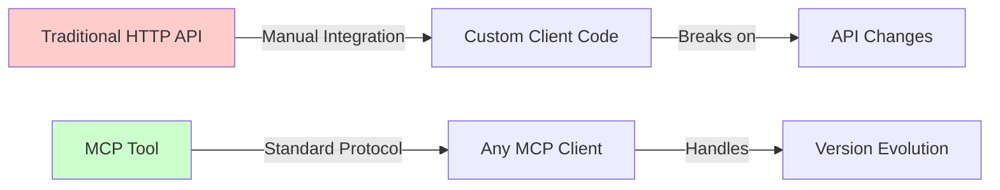

# Chapter 1 - Running Examples Guide

## ✅ All Examples Are Now Working .cs Files

Chapter 1 demonstrates the **evolution from traditional HTTP integration to MCP** through 2 runnable examples.

## 🚀 Running the Examples

### Quick Start
```powershell
cd HandsOnMCPCSharp\Chapter01\code
dotnet run
```

This runs both examples in sequence:
1. **Pre-MCP Integration** - Traditional HTTP client approach
2. **With MCP Integration** - Modern MCP tool approach

## 📁 File Structure

```
Chapter01/code/
├── Program.cs                              ✅ Main runner (both examples)
├── Shared.cs                               ✅ Domain models + interfaces
├── MockFlightSearchService.cs              ✅ Mock service (3 sample flights)
│
├── ch01_1_without_mcp_integration.cs       ✅ Example 1: Pre-MCP approach
├── ch01_2_with_mcp_search_flights.cs       ✅ Example 2: MCP tool approach
│
├── ch01_1_without_mcp_integration.cs.example  📝 Original reference
└── ch01_2_with_mcp_search_flights.cs.example  📝 Original reference
```

## 🎯 The Two Examples Explained

### Example 1: Without MCP Integration
**File**: `ch01_1_without_mcp_integration.cs`

**Problem Demonstrated**:
- ❌ Manual HTTP endpoint creation
- ❌ Custom JSON serialization/deserialization
- ❌ No standardized error handling
- ❌ Client must understand API structure
- ❌ No discovery mechanism

**Code Pattern**:
```csharp
[ApiController]
[Route("api/flights")]
public class FlightsController : ControllerBase
{
    [HttpGet("search")]
    public async Task<IActionResult> SearchFlights(
        string origin, string destination, string date)
    {
        // Manual implementation
        // Custom error handling
        // No type safety for clients
    }
}
```

### Example 2: With MCP Integration
**File**: `ch01_2_with_mcp_search_flights.cs`

**Solution Provided**:
- ✅ Declarative tool definition
- ✅ Automatic schema generation
- ✅ Built-in error handling
- ✅ Standardized JSON-RPC protocol
- ✅ Self-describing capabilities

**Code Pattern**:
```csharp
[McpServerToolType]
public class SearchFlightsTool
{
    [McpServerTool, Description("Search for available flights...")]
    public static async Task<FlightSearchResult> SearchFlights(
        [Description("Origin airport code")] string origin,
        [Description("Destination airport code")] string destination,
        [Description("Departure date")] string date,
        IFlightSearchService searchService)
    {
        // Simple implementation
        // MCP handles the rest
    }
}
```

## 📊 Side-by-Side Comparison

| Aspect | Without MCP | With MCP |
|--------|-------------|----------|
| **Setup Complexity** | High (HTTP controllers, routing, middleware) | Low (attribute-based) |
| **Type Safety** | Client-side only | Full stack |
| **Documentation** | Manual (Swagger/OpenAPI) | Automatic (from descriptions) |
| **Error Handling** | Custom per endpoint | Standardized JSON-RPC |
| **Discovery** | External (API docs) | Built-in (MCP capabilities) |
| **Protocol** | Custom HTTP/REST | JSON-RPC 2.0 |
| **Versioning** | Manual URL/header based | Built-in deprecation support |

## 🔍 What Program.cs Shows

The `Program.cs` file runs both examples and displays a comparison:

```
╔════════════════════════════════════════════════════════════════╗
║             Chapter 1 — MCP Integration Demo                  ║
╚════════════════════════════════════════════════════════════════╝

────────────────────────────────────────────────────────────────
Example 1: WITHOUT MCP Integration
────────────────────────────────────────────────────────────────
[Shows traditional HTTP approach challenges]

────────────────────────────────────────────────────────────────
Example 2: WITH MCP Integration
────────────────────────────────────────────────────────────────
[Shows MCP tool benefits]
```

## 🎓 Educational Value

### Key Learning Points

1. **Before MCP (Example 1)**:
   - Manual HTTP endpoint setup
   - Custom serialization logic
   - Per-endpoint error handling
   - Client-specific integration code

2. **After MCP (Example 2)**:
   - Declarative tool attributes
   - Automatic schema generation
   - Standardized protocol
   - Universal client compatibility

### Real-World Impact



## 💡 When to Use Each Approach

### Traditional HTTP (Example 1)
Use when:
- ❌ **Don't use** - This is the "before" example showing the problem

### MCP Tools (Example 2)
Use when:
- ✅ Building AI-accessible capabilities
- ✅ Need standardized integration
- ✅ Want automatic documentation
- ✅ Require version management
- ✅ Building cross-platform tools

## 🧪 Testing the Examples

### Build and Run
```powershell
# Set SDK path (if needed)
$env:MSBuildSDKsPath = 'C:\Program Files\dotnet\sdk\10.0.201\Sdks'

# Build
cd HandsOnMCPCSharp\Chapter01\code
dotnet build

# Run both examples
dotnet run
```

### Expected Output
1. **Example 1 Output**: Shows HTTP controller pattern with issues
2. **Example 2 Output**: Shows MCP tool pattern with benefits
3. **Flight Results**: 3 mock flights (BA, VA, LH) displayed in both

## 📚 Related Files

- **README.md** - Complete chapter documentation with Mermaid diagrams
- **Shared.cs** - Domain models (`FlightOption`, `Money`, `FlightSearchResult`)
- **MockFlightSearchService.cs** - Returns 3 sample flights for testing

## ✅ Verification

All examples compile and run successfully:

```powershell
# Build
dotnet build   # ✅ Success

# Run
dotnet run     # ✅ Both examples execute
```

## 📝 Summary

**Purpose**: Demonstrate the value proposition of MCP over traditional HTTP APIs

**Examples**:
- ✅ 2 working .cs files showing before/after
- ✅ Side-by-side comparison in output
- ✅ Same business logic, different integration patterns

**Key Takeaway**: MCP provides standardization, type safety, and automatic tooling that traditional HTTP APIs require manual effort to achieve.

---

**Status**: ✅ All Chapter 1 examples working  
**Build**: ✅ Successful  
**Pattern**: Pre-MCP vs MCP comparison
