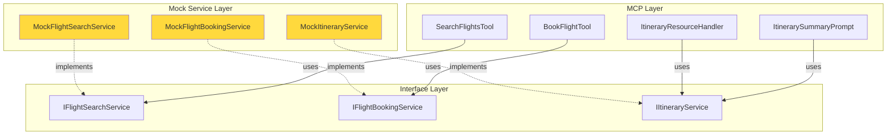
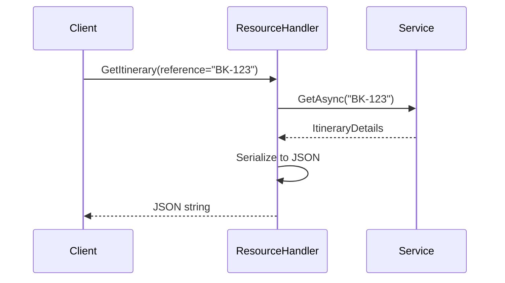
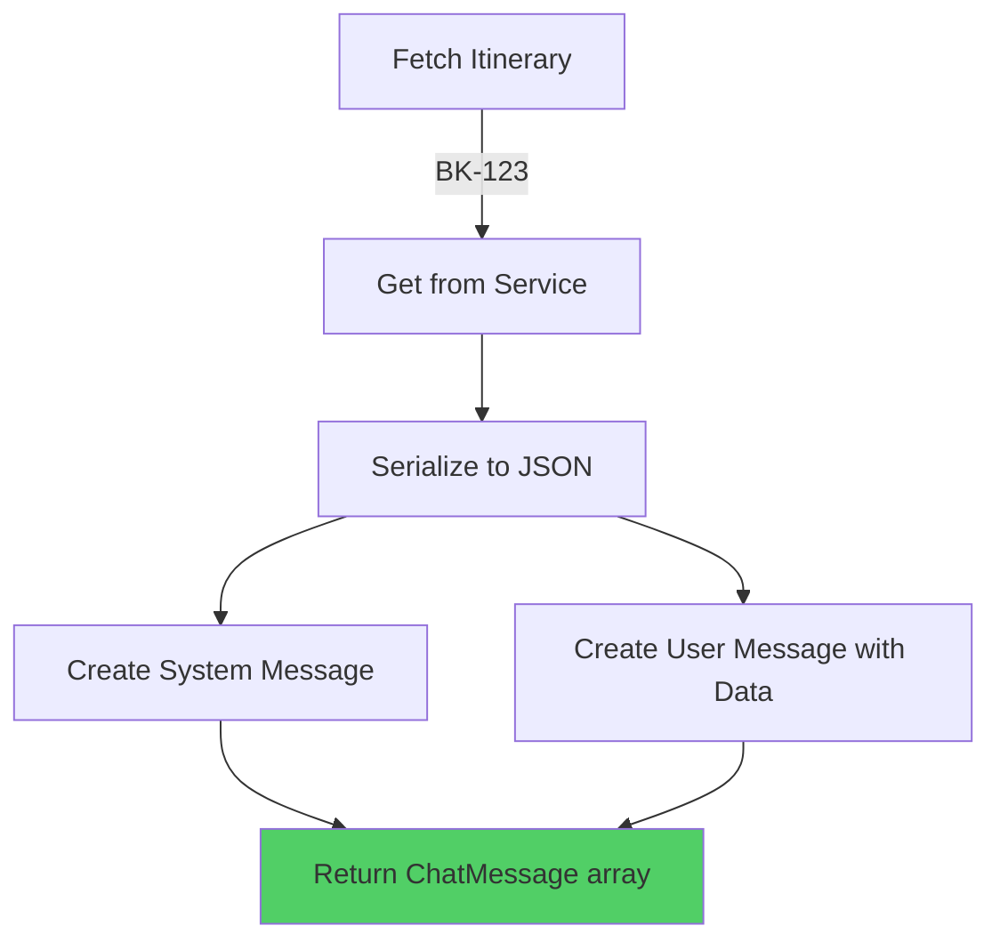
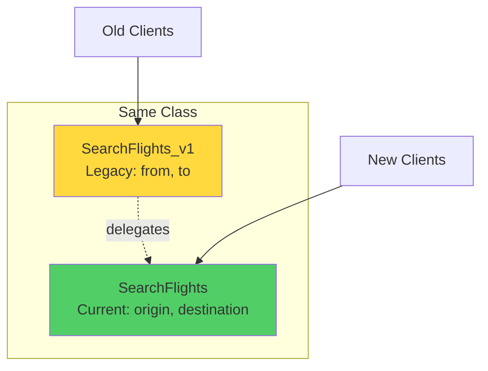
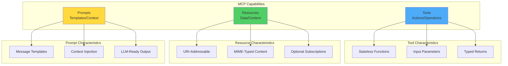
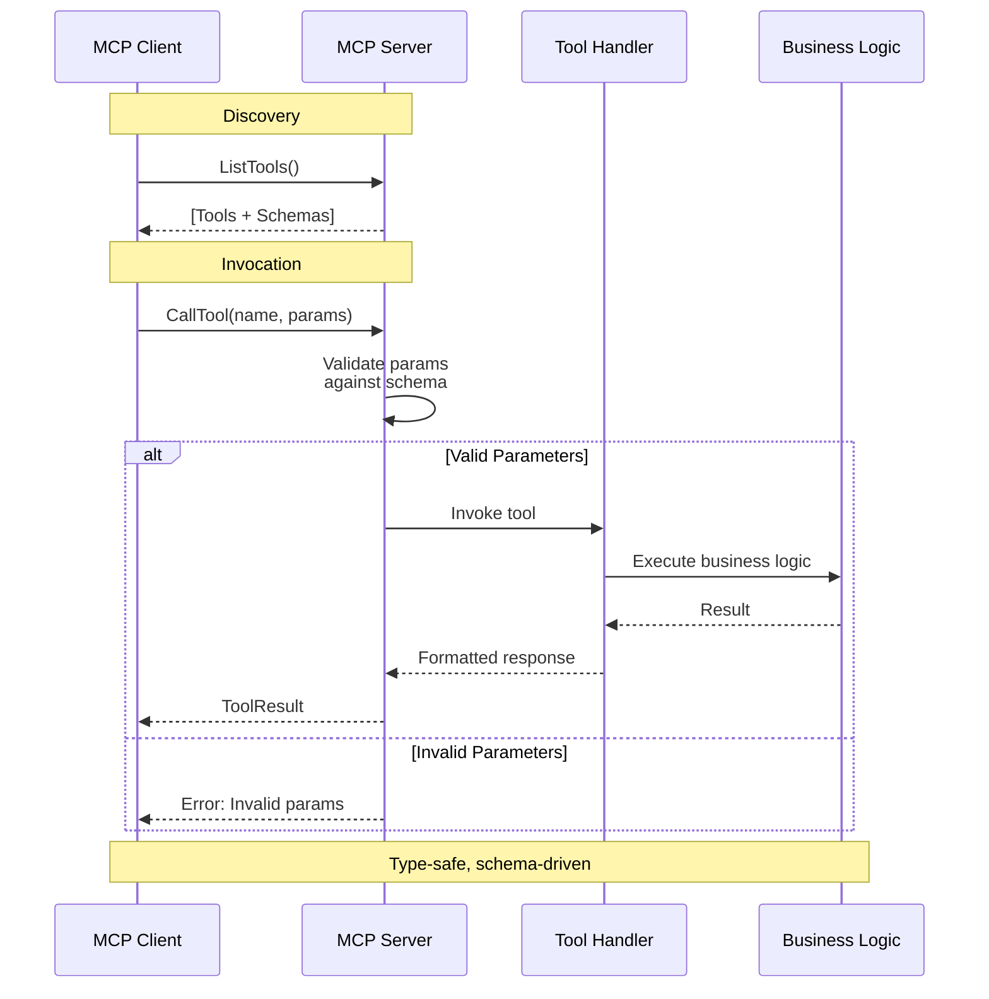
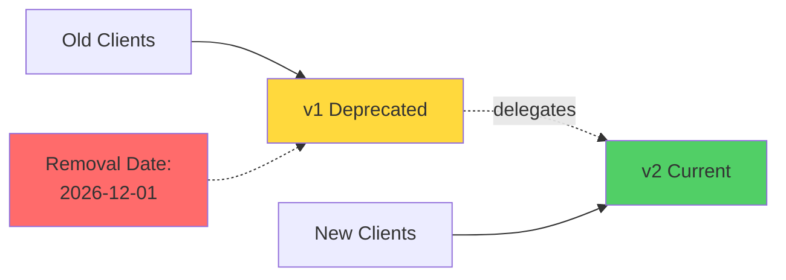

# Chapter 2: MCP Fundamentals - Protocol, Roles, and Capabilities

## Overview

This chapter provides a hands-on tour of the MCP specification, covering JSON-RPC 2.0 message patterns, capability descriptors for **tools**, **resources**, and **prompts**, the full request/response lifecycle, and versioning strategies. Every concept is demonstrated with runnable C# code.

## 📁 Project Structure

```
Chapter02/code/
├── Chapter02.csproj                          # Project configuration
├── Program.cs                                # Main demonstration orchestrator
├── Shared.cs                                 # Extended domain models & interfaces
├── MockServices.cs                           # Mock service implementations
│
├── ch02_2_book_flight_tool.cs                # ✅ Tool with error handling
├── ch02_3_itinerary_resource_handler.cs      # ✅ Resource URI handler
├── ch02_4_itinerary_summary_prompt.cs        # ✅ Multi-message prompt
├── ch02_5_search_flights_deprecation.cs      # ✅ Tool versioning pattern
│
├── ContractVerificationDemo.cs               # ✅ Contract testing demonstration
├── CONTRACT_TESTS_README.md                  # Integration testing guide
│
├── ch02_1_search_flights_contract_tests.cs.example    # Integration test (requires server)
└── ch02_6_schema_compatibility_tests.cs.example       # Schema regression test
```

## 🎯 Learning Objectives

- ✅ Trace full MCP request/response streams
- ✅ Author clear capability schemas with descriptions
- ✅ Model tool, resource, and prompt lifecycles
- ✅ Plan non-breaking capability evolution
- ✅ Implement contract testing strategies

## 📚 Code Files Explained

### Supporting Infrastructure

#### `Shared.cs` - Extended Domain Models

Builds on Chapter 1 with booking and itinerary types:

```csharp
// Chapter 1 types (inherited)
FlightOption, Money, FlightSearchResult, IFlightSearchService

// Chapter 2 additions
PassengerInput       - Passenger booking data
BookingConfirmation  - Booking result with reference
ItineraryDetails     - Complete itinerary information
PromptMessage        - Prompt message for LLM contexts

// Service Interfaces
IFlightBookingService  - Booking operations
IItineraryService      - Itinerary retrieval
```

> **TIP**: Notice how `Shared.cs` grows incrementally. Chapter 1 defined search, Chapter 2 adds booking and itineraries. This mirrors real-world API evolution!

#### `MockServices.cs` - Service Implementations

Provides three mock services for demonstrations:

1. **MockFlightSearchService**
   - Returns sample flights (BA, Virgin, Lufthansa)
   - Same implementation as Chapter 1

2. **MockFlightBookingService**
   - Simulates booking with availability tracking
   - Throws `FlightNotAvailableException` for double-booking
   - Generates realistic booking references

3. **MockItineraryService**
   - Pre-populated with sample itinerary (BK-SAMPLE123)
   - Allows adding new itineraries dynamically
   - Used by resource and prompt examples

**Architecture Diagram**:



> **IMPORTANT NOTE**: The mock services simulate stateful behavior (e.g., booking conflicts) to demonstrate proper error handling patterns. In production, these would connect to real databases or APIs.

### Working Examples

#### Example 1: `ContractVerificationDemo.cs` - Contract Testing

Demonstrates what the `.example` integration tests do without requiring a running server:


**Verifications Shown**:
1. ✅ Tool registration check
2. ✅ Required fields in schema (origin, destination, date)
3. ✅ Tool execution with valid inputs
4. ✅ Parameter descriptions present

> **TIP**: This demo shows the *concept* of contract testing. For real integration tests connecting to a live MCP server, see `CONTRACT_TESTS_README.md`.

#### Example 2: `ch02_2_book_flight_tool.cs` - Tool Implementation

Demonstrates a complete tool with business logic and error handling:

**Key Patterns**:
- ✅ Input validation (empty checks)
- ✅ Business exceptions (`FlightNotAvailableException`)
- ✅ Descriptive return messages for LLMs
- ✅ Graceful cancellation handling

```csharp
[McpServerToolType]
public sealed class BookFlightTool(IFlightBookingService bookingService)
{
    [McpServerTool]
    [Description("Book a seat on a specific flight...")]
    public async Task<string> BookFlightAsync(
        [Description("The unique flight identifier")] string flightId,
        [Description("Passenger first name")] string firstName,
        // ... more parameters
    )
    {
        // Returns human-readable strings for LLM consumption
        return "Booking confirmed. Reference: BK-123...";
    }
}
```

**Why String Return Type?**
- LLMs consume the result directly
- No additional parsing needed
- Descriptive messages work across all clients

#### Example 3: `ch02_3_itinerary_resource_handler.cs` - Resource Pattern

Demonstrates MCP resource concepts (dynamic data retrieval):

**Resource Pattern**:


**Key Concepts**:
- URI template pattern: `itinerary://booking/{reference}`
- Dynamic parameter extraction from URI
- JSON serialization for structured data
- Error handling (not found, invalid reference)

> **IMPORTANT NOTE**: In the full MCP SDK, resources support subscriptions for real-time updates. This simplified version demonstrates the core retrieval pattern.

#### Example 4: `ch02_4_itinerary_summary_prompt.cs` - Prompt Template

Demonstrates multi-message prompts for LLM context injection:

**Prompt Flow**:


**Returns**:
```json
[
  {
    "role": "system",
    "content": "You are a travel assistant. Summarise..."
  },
  {
    "role": "user",
    "content": "Itinerary data:\n{...json...}"
  }
]
```

**Why Two Messages?**
- System message sets context/behavior
- User message provides concrete data
- LLM receives both instruction and information

#### Example 5: `ch02_5_search_flights_deprecation.cs` - Tool Versioning

Demonstrates side-by-side versioning for backward compatibility:



**Versioning Strategy**:
```csharp
[McpServerToolType]
public class SearchFlightsWithDeprecation {
    // Current version with canonical names
    [McpServerTool]
    public Task<FlightSearchResult> SearchFlightsAsync(
        string origin, string destination, ...) { }

    // Legacy version with old parameter names
    [McpServerTool(Name = "SearchFlights_v1")]
    [Description("[DEPRECATED] Use SearchFlights instead...")]
    public Task<FlightSearchResult> SearchFlights_v1Async(
        string from, string to, ...) 
    {
        // Delegate to current version
        return SearchFlightsAsync(origin: from, destination: to, ...);
    }
}
```

**Benefits**:
- ✅ Old clients continue working
- ✅ New clients use improved API
- ✅ Deprecation clearly communicated
- ✅ Removal date specified
- ✅ Zero code duplication (delegation pattern)

### Integration Test Examples (`.example` files)

#### `ch02_1_search_flights_contract_tests.cs.example`

Full integration tests requiring a running MCP server:

```csharp
[Fact]
public async Task SearchFlights_tool_is_registered()
{
    var tools = await _client!.ListToolsAsync();
    var searchTool = tools.FirstOrDefault(t => t.Name == "SearchFlights");
    Assert.NotNull(searchTool);
}
```

**Why `.example`?**
- ❌ Requires external MCP server (Chapter 3+)
- ❌ Needs xunit test framework
- ❌ Uses `McpClient` (may be internal in current SDK)

**To Run**: See `CONTRACT_TESTS_README.md` for setup instructions.

#### `ch02_6_schema_compatibility_tests.cs.example`

Schema snapshot tests for regression detection:

```csharp
[Fact]
public async Task Tool_schema_matches_snapshot()
{
    // Compare current schema to saved baseline
    // Detect unintended breaking changes
}
```

**Purpose**: Catch accidental schema changes that break existing clients.

## 🚀 Building and Running

### Prerequisites

- **.NET SDK 10.0.201** or later
- **Visual Studio 2022+** or .NET CLI
- **PowerShell** (recommended for environment setup)

### Quick Start

```powershell
# Navigate to project
cd HandsOnMCPCSharp\Chapter02\code

# Build
dotnet build

# Run all demonstrations
dotnet run
```

### Expected Output

```
╔════════════════════════════════════════════════════════════════╗
║       Chapter 2 — MCP Fundamentals: Tools & Capabilities     ║
╚════════════════════════════════════════════════════════════════╝

╔════════════════════════════════════════════════════════════════╗
║           Contract Verification Demonstration                 ║
╚════════════════════════════════════════════════════════════════╝

1. Tool Registration Verification
  ✓ SearchFlights tool would be registered
  - Name: SearchFlights
  - Parameters: origin, destination, date

2. Schema Required Fields Verification
  ✓ required array contains: origin ✓
  ✓ required array contains: destination ✓
  ✓ required array contains: date ✓

...

Example 2: BookFlightTool - Business Logic & Error Handling
  ✓ Successful Booking:
    Booking confirmed. Reference: BK-XXX...
  ✗ Failed Booking (validation error):
    Booking failed: flightId must not be empty.

...

═══════════════════════════════════════════════════════════════
Chapter 2 demonstrations completed successfully!
Key Concepts: Tools, Resources, Prompts, Versioning, Contracts
═══════════════════════════════════════════════════════════════
```

## 🛠️ SDK Environment Setup

### MSBuildSDKsPath Configuration

If you encounter SDK path errors:

```
error MSB4019: The imported project "C:\Program Files\dotnet\sdk\8.0.414\..." was not found
```

**Solution**: Set environment variable before building:

```powershell
# PowerShell (recommended)
$env:MSBuildSDKsPath = 'C:\Program Files\dotnet\sdk\10.0.201\Sdks'
dotnet build
dotnet run
```

```cmd
REM Command Prompt
set MSBuildSDKsPath=C:\Program Files\dotnet\sdk\10.0.201\Sdks
dotnet build
```

### Permanent Setup

```powershell
# Add to PowerShell profile
notepad $PROFILE

# Add this line:
$env:MSBuildSDKsPath = 'C:\Program Files\dotnet\sdk\10.0.201\Sdks'

# Reload
. $PROFILE
```

> **TIP**: Set this once per session. All subsequent `dotnet` commands will work without repeating it!

### Verify Installation

```powershell
# Check SDKs
dotnet --list-sdks

# Should include:
# 10.0.201 [C:\Program Files\dotnet\sdk]

# Check project config
Get-Content ..\..\..\global.json
```

### Install .NET 10 (if needed)

```powershell
winget install Microsoft.DotNet.SDK.10 --accept-source-agreements --accept-package-agreements
```

## 📊 MCP Capability Architecture

### Three Capability Types



### Tool Lifecycle



### Resource vs Tool Decision Matrix

| Use Case | Choose Tool | Choose Resource |
|----------|-------------|-----------------|
| **Execute action** (book flight, send email) | ✅ | ❌ |
| **Retrieve data** (get itinerary, read file) | ❌ | ✅ |
| **Transform data** (calculate, aggregate) | ✅ | ❌ |
| **URI-addressable content** | ❌ | ✅ |
| **Requires parameters** | ✅ Both | ✅ Both |
| **Supports subscriptions** (live updates) | ❌ | ✅ |
| **Idempotent operations** | Either | ✅ |

> **IMPORTANT NOTE**: Tools = **Actions/Operations**, Resources = **Data/Content**. If it changes state, use a Tool. If it retrieves information, use a Resource.

## 🎓 Key Concepts

### 1. Tool Registration

```csharp
[McpServerToolType]  // Marks class containing tools
public class MyTools {
    [McpServerTool]  // Marks individual tool method
    [Description("What the tool does")]
    public async Task<ResultType> MyToolAsync(
        [Description("What this parameter means")] string param
    )
}
```

**Auto-Generated**:
- JSON Schema from C# types
- Parameter descriptions from attributes
- Required/optional based on nullability
- Type constraints from C# type system

### 2. Error Handling Patterns

```csharp
// Business-level exceptions
try {
    await bookingService.BookAsync(...);
} catch (FlightNotAvailableException ex) {
    return $"Flight {ex.FlightId} no longer available";
}

// Validation errors
if (string.IsNullOrWhiteSpace(param))
    return "Error: param must not be empty";

// Returns are LLM-readable strings
return "Booking confirmed. Reference: BK-123...";
```

### 3. Versioning Strategy



**Best Practices**:
1. Keep old version alive during transition
2. Clearly mark as deprecated in description
3. Specify removal date
4. Delegate to new implementation (DRY)
5. Monitor usage before removing

## 🐛 Troubleshooting

### Build Issues

**Problem**: `error NU1008: PackageReference items cannot define a value for Version`

**Solution**: CPM is disabled for this chapter. This error shouldn't occur. If it does, verify:
```xml
<ManagePackageVersionsCentrally>false</ManagePackageVersionsCentrally>
```

---

**Problem**: `error CS7022: The entry point of the program is global code`

**Solution**: xunit was accidentally included. Remove from `Chapter02.csproj`:
```xml
<!-- Remove these if present -->
<PackageReference Include="xunit.v3" />
<PackageReference Include="xunit.runner.visualstudio" />
```

### Runtime Issues

**Problem**: Examples don't match documentation

**Solution**: Ensure you're running the latest code:
```powershell
dotnet clean
dotnet build
dotnet run
```

---

**Problem**: Want to run integration tests (`.example` files)

**Solution**: See `CONTRACT_TESTS_README.md` for detailed setup instructions. You'll need:
- A running MCP server (Chapter 3+)
- xunit test framework
- Separate test project

## 🔗 Resources

### Documentation
- **MCP Specification**: https://spec.modelcontextprotocol.io/
- **C# SDK Repository**: https://github.com/modelcontextprotocol/csharp-sdk
- **Contract Testing Guide**: `CONTRACT_TESTS_README.md`

### Related Chapters
- **Chapter 1**: MCP motivation and comparison
- **Chapter 3**: Full server implementation (needed for integration tests)

### Solution-Level Docs
- **Build Guide**: `../../../CHANGES.md`
- **InMemoryTransport Sample**: `../../../samples/InMemoryTransport/README.md`

## 📝 Next Steps

1. ✅ **Completed**: Understand MCP fundamentals
2. ➡️ **Next**: Chapter 3 - Full server implementation
   - ASP.NET Core hosting
   - HTTP/SSE transports
   - Dependency injection
   - Production deployment

```powershell
cd ..\Chapter03\code
dotnet build
dotnet run
```

---

**Last Updated**: March 30, 2026  
**SDK Version**: .NET 10.0.201  
**MCP SDK**: Local project reference (latest)  
**Status**: ✅ 5/5 examples working, 2 integration tests documented

## Further reading

- MCP specification — roles and transports: https://modelcontextprotocol.io/docs/concepts/architecture
- JSON Schema reference: https://json-schema.org/
