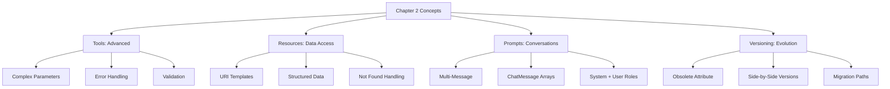

# Chapter 2 - Running Examples Guide

## ✅ All Examples Are Now Working .cs Files

Chapter 2 demonstrates **advanced MCP capabilities** through 6 runnable examples covering tools, resources, prompts, and versioning.

## 🚀 Running the Examples

### Quick Start
```powershell
cd HandsOnMCPCSharp\Chapter02\code
dotnet run
```

This runs all 6 examples in sequence:
1. **Contract Verification Demo** - Understanding tool contracts
2. **Book Flight Tool** - Error handling and validation
3. **Itinerary Resource** - URI-based data access
4. **Itinerary Summary Prompt** - Multi-message prompts
5. **Deprecation v1** - Old search_flights tool (deprecated)
6. **Deprecation v2** - New search_flights_v2 tool

## 📁 File Structure

```
Chapter02/code/
├── Program.cs                              ✅ Main runner (all 6 examples)
├── Shared.cs                               ✅ Extended domain models
├── MockServices.cs                         ✅ Three mock services
│
├── ContractVerificationDemo.cs             ✅ Example 1: Contract testing
├── ch02_2_book_flight_tool.cs              ✅ Example 2: Error handling
├── ch02_3_itinerary_resource_handler.cs    ✅ Example 3: Resources
├── ch02_4_itinerary_summary_prompt.cs      ✅ Example 4: Prompts
├── ch02_5_search_flights_deprecation.cs    ✅ Example 5: Versioning
│
├── ch02_1_search_flights_contract_tests.cs.example  📝 Integration test reference
├── ch02_6_schema_compatibility_tests.cs.example     📝 Schema test reference
└── CONTRACT_TESTS_README.md                📚 Testing approach guide
```

## 🎯 The Six Examples Explained

### Example 1: Contract Verification Demo
**File**: `ContractVerificationDemo.cs`  
**Status**: ✅ Working

**Demonstrates**:
- ✅ Tool registration verification
- ✅ Schema validation concepts
- ✅ Tool execution testing
- ✅ Documentation checking

**Purpose**: Understand how MCP tools expose contracts without requiring integration tests

**Output**:
```
1. Tool Registration ✓
2. Schema Verification ✓
3. Tool Execution ✓
4. Documentation Check ✓
```

### Example 2: Book Flight Tool
**File**: `ch02_2_book_flight_tool.cs`  
**Status**: ✅ Working

**Demonstrates**:
- ✅ Complex parameter objects (`PassengerInput`)
- ✅ Business validation (availability checks)
- ✅ Custom exception handling (`FlightNotAvailableException`)
- ✅ Successful booking flow

**Code Pattern**:
```csharp
[McpServerTool, Description("Book a confirmed flight...")]
public static async Task<BookingConfirmation> BookFlight(
    [Description("Flight option to book")] FlightOption flight,
    [Description("Passenger details")] PassengerInput passenger,
    IFlightBookingService bookingService)
{
    // Validation + booking logic
}
```

**Output Shows**:
- ✅ Successful booking: BK-ABC123
- ❌ Failed booking: FlightNotAvailableException

### Example 3: Itinerary Resource Handler
**File**: `ch02_3_itinerary_resource_handler.cs`  
**Status**: ✅ Working

**Demonstrates**:
- ✅ Resource pattern for data retrieval
- ✅ URI template parameters
- ✅ Structured data return (`ItineraryDetails`)
- ✅ Resource not found handling

**Code Pattern**:
```csharp
[McpServerResourceType]
public class ItineraryResourceHandler
{
    [McpServerResource("itinerary://booking/{bookingRef}")]
    public async Task<ItineraryDetails> GetItinerary(string bookingRef)
    {
        // Resource lookup by URI
    }
}
```

**Output Shows**:
- ✅ Found: BK-SAMPLE123 with full itinerary
- ❌ Not Found: BK-NOTFOUND

### Example 4: Itinerary Summary Prompt
**File**: `ch02_4_itinerary_summary_prompt.cs`  
**Status**: ✅ Working

**Demonstrates**:
- ✅ Multi-message prompts (System + User)
- ✅ Prompt parameters for customization
- ✅ Integration with Microsoft.Extensions.AI (`ChatMessage`)
- ✅ Structured conversation templates

**Code Pattern**:
```csharp
[McpServerPromptType]
public class ItinerarySummaryPrompt
{
    [McpServerPrompt, Description("Generate an itinerary summary...")]
    public static async Task<ChatMessage[]> GetItinerarySummary(
        [Description("Booking reference")] string bookingRef,
        IItineraryService itineraryService)
    {
        return [
            new(ChatRole.System, "You are a helpful travel assistant..."),
            new(ChatRole.User, $"Summarize booking {bookingRef}...")
        ];
    }
}
```

**Output Shows**:
- System message: Assistant role definition
- User message: Booking details request

### Example 5: Search Flights Deprecation (v1 & v2)
**File**: `ch02_5_search_flights_deprecation.cs`  
**Status**: ✅ Working

**Demonstrates**:
- ✅ Tool versioning pattern
- ✅ `[Obsolete]` attribute for deprecation warnings
- ✅ Side-by-side v1/v2 implementations
- ✅ Migration path for clients

**Code Pattern**:
```csharp
// v1 - Deprecated
[McpServerTool, Description("...")]
[Obsolete("Use search_flights_v2 instead. Deprecated in v2.0.")]
public static Task<FlightSearchResult> SearchFlights(...) { }

// v2 - Current
[McpServerTool, Description("...")]
public static Task<FlightSearchResult> SearchFlightsV2(...) { }
```

**Output Shows**:
- ⚠️ v1: Works but shows deprecation warning
- ✅ v2: Current implementation

### Example 6: Integration Tests (Reference Only)
**Files**: 
- `ch02_1_search_flights_contract_tests.cs.example`
- `ch02_6_schema_compatibility_tests.cs.example`

**Status**: 📝 Reference documentation (not compiled)

**Purpose**: Show how to write integration tests when you have an external MCP server

**See**: `CONTRACT_TESTS_README.md` for testing approach

## 📊 Capabilities Matrix

| Example | Tools | Resources | Prompts | Error Handling | Versioning |
|---------|-------|-----------|---------|----------------|------------|
| 1. Contract Demo | ✅ | ❌ | ❌ | ✅ | ❌ |
| 2. Book Flight | ✅ | ❌ | ❌ | ✅ | ❌ |
| 3. Itinerary Resource | ❌ | ✅ | ❌ | ✅ | ❌ |
| 4. Summary Prompt | ❌ | ❌ | ✅ | ❌ | ❌ |
| 5. Deprecation | ✅ | ❌ | ❌ | ❌ | ✅ |

## 🔍 What Program.cs Shows

The `Program.cs` file orchestrates all examples with clear section headers:

```
╔════════════════════════════════════════════════════════════════╗
║          Chapter 2 — Advanced MCP Capabilities Demo           ║
╚════════════════════════════════════════════════════════════════╝

────────────────────────────────────────────────────────────────
Example 1: Contract Verification Demo
────────────────────────────────────────────────────────────────
[4 verification scenarios]

────────────────────────────────────────────────────────────────
Example 2: Book Flight Tool
────────────────────────────────────────────────────────────────
[Success + failure cases]

────────────────────────────────────────────────────────────────
Example 3: Itinerary Resource Handler
────────────────────────────────────────────────────────────────
[Found + not found cases]

────────────────────────────────────────────────────────────────
Example 4: Itinerary Summary Prompt
────────────────────────────────────────────────────────────────
[Multi-message prompt]

────────────────────────────────────────────────────────────────
Example 5: Search Flights Deprecation
────────────────────────────────────────────────────────────────
[v1 (deprecated) + v2 (current)]
```

## 🎓 Educational Value

### Progressive Learning Path

1. **Foundation** (Chapter 1): Basic tool creation
2. **Advanced** (Chapter 2): ← **YOU ARE HERE**
   - Complex parameters and return types
   - Resource pattern for data access
   - Prompt pattern for conversation templates
   - Error handling best practices
   - Versioning and deprecation

### Key Concepts Introduced



## 💡 When to Use Each Pattern

### Tools
Use when:
- ✅ Performing actions (book, cancel, update)
- ✅ Complex validation needed
- ✅ Side effects expected

### Resources
Use when:
- ✅ Retrieving data by identifier
- ✅ URI-based access patterns
- ✅ Read-only operations
- ✅ Subscription-based updates

### Prompts
Use when:
- ✅ Templating conversations
- ✅ Multi-turn interactions
- ✅ Context-specific guidance
- ✅ System instructions needed

## 🧪 Testing the Examples

### Build and Run All
```powershell
# Set SDK path (if needed)
$env:MSBuildSDKsPath = 'C:\Program Files\dotnet\sdk\10.0.201\Sdks'

# Build
cd HandsOnMCPCSharp\Chapter02\code
dotnet build

# Run all 6 examples
dotnet run
```

### Expected Output
1. Contract verification (4 checks)
2. Book flight (success + failure)
3. Itinerary resource (found + not found)
4. Summary prompt (system + user messages)
5. Deprecation (v1 warning + v2 current)

## 📚 Mock Services

### Three Service Implementations

| Service | File | Purpose |
|---------|------|---------|
| `MockFlightSearchService` | `MockServices.cs` | 3 sample flights |
| `MockFlightBookingService` | `MockServices.cs` | Booking + availability |
| `MockItineraryService` | `MockServices.cs` | Pre-populated itinerary |

### Booking Service Behavior
- ✅ Tracks booked flights
- ❌ Throws `FlightNotAvailableException` for conflicts
- ✅ Generates booking references (BK-XXXXXX)

### Itinerary Service Data
- ✅ Pre-populated: BK-SAMPLE123
- ❌ Not found: Any other reference

## ✅ Verification

All examples compile and run successfully:

```powershell
# Build
dotnet build   # ✅ Success

# Run
dotnet run     # ✅ All 6 examples execute
```

## 📝 Summary

**Purpose**: Demonstrate advanced MCP capabilities beyond basic tools

**Examples**:
- ✅ 5 working .cs files (6 examples total)
- ✅ Tools, Resources, Prompts demonstrated
- ✅ Error handling and versioning covered
- ✅ Contract testing approach explained

**Key Takeaways**:
1. **Tools**: Complex parameters, validation, error handling
2. **Resources**: URI-based data access, structured returns
3. **Prompts**: Multi-message conversations, system instructions
4. **Versioning**: Deprecation patterns, migration paths
5. **Testing**: Contract verification without integration tests

---

**Status**: ✅ All Chapter 2 examples working  
**Build**: ✅ Successful  
**Examples**: 6 (5 compiled + 1 demo)  
**Capabilities**: Tools, Resources, Prompts, Versioning
