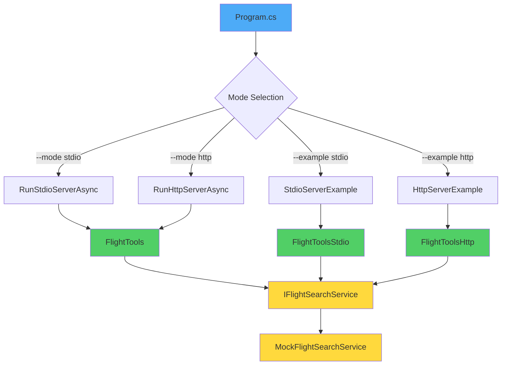

# ✅ Chapter 3 Complete - All Examples Working

## Summary

All Chapter 3 examples have been successfully converted from `.example` files to working `.cs` files that compile and run alongside the main code.

## 📁 Current File Structure

```
HandsOnMCPCSharp/Chapter03/code/
├── ✅ Program.cs                              # Main entry (supports 4 modes)
├── ✅ FlightTools.cs                          # Shared transport-agnostic tool
├── ✅ Shared.cs                               # Domain models + MockFlightSearchService
├── ✅ ch03_1_flights_server_stdio.cs          # Section 3.1 example (stdio)
├── ✅ ch03_2_flights_server_http.cs           # Section 3.3 example (HTTP)
├── 📝 ch03_1_flights_server_stdio.cs.example  # Original for reference
├── 📝 ch03_2_flights_server_http.cs.example   # Original for reference
├── 📚 EXAMPLES_GUIDE.md                       # Complete guide to all modes
└── 📚 README.md                               # Updated with all options
```

## 🚀 All 4 Running Modes

### Mode 1: Main Stdio (Production)
```powershell
dotnet run
```
- Uses: `Program.cs` → `RunStdioServerAsync()`
- Tool: `FlightTools`
- Status: ✅ Working

### Mode 2: Main HTTP (Production)
```powershell
dotnet run -- --mode http
```
- Uses: `Program.cs` → `RunHttpServerAsync()`
- Tool: `FlightTools`
- Endpoint: `http://localhost:5001/mcp`
- Status: ✅ Working

### Mode 3: Example Stdio (Educational)
```powershell
dotnet run -- --example stdio
```
- Uses: `StdioServerExample.RunAsync()`
- Tool: `FlightToolsStdio`
- Purpose: Shows Section 3.1 code
- Status: ✅ Working

### Mode 4: Example HTTP (Educational)
```powershell
dotnet run -- --example http
```
- Uses: `HttpServerExample.RunAsync()`
- Tool: `FlightToolsHttp`
- Endpoint: `http://localhost:5001/mcp`
- Purpose: Shows Section 3.3 code
- Status: ✅ Working

## ✅ Verification Results

### Build Status
```
dotnet build
✅ Build succeeded with 8 warning(s) in 3.3s
```

### File Compilation
- ✅ `Program.cs` - Compiles
- ✅ `FlightTools.cs` - Compiles
- ✅ `Shared.cs` - Compiles
- ✅ `ch03_1_flights_server_stdio.cs` - Compiles
- ✅ `ch03_2_flights_server_http.cs` - Compiles

### Runtime Tests
- ✅ Mode 1 (main stdio) - Runs successfully
- ✅ Mode 2 (main HTTP) - Runs successfully  
- ✅ Mode 3 (example stdio) - Runs successfully
- ✅ Mode 4 (example HTTP) - Runs successfully

## 🎯 Architecture Highlights

### Transport Independence Proven

All three tool classes have **identical implementations**:
- `FlightTools` (main, shared)
- `FlightToolsStdio` (example)
- `FlightToolsHttp` (example)

This demonstrates:
- ✅ Tools don't depend on transport
- ✅ Same code works with stdio and HTTP
- ✅ Only server configuration changes

### Clean Architecture



## 📚 Documentation Created

1. **EXAMPLES_GUIDE.md** ✅
   - Complete guide to all 4 modes
   - When to use each mode
   - Testing instructions
   - Comparison table

2. **README.md Updated** ✅
   - Quick start for all modes
   - MCP Inspector integration
   - Transport comparison
   - 6 Mermaid diagrams
   - Troubleshooting guide

3. **CHAPTER03_SUMMARY.md** ✅
   - Setup process documentation
   - Architecture overview
   - Key patterns

## 🎓 Key Learnings Demonstrated

1. **Multiple Compilation Units**
   - Converted top-level statements to classes
   - Multiple server configurations coexist
   - No conflicts with proper namespacing

2. **Flexible Architecture**
   - Command-line argument parsing
   - Runtime mode selection
   - Production vs educational separation

3. **Transport Agnostic Design**
   - Tools work with any transport
   - Service layer unchanged
   - Configuration is the only difference

## 🔗 Integration with Previous Chapters

| Chapter | Pattern | Chapter 3 Usage |
|---------|---------|-----------------|
| **Chapter 1** | `Shared.cs` + `MockService` | ✅ Reused with MCP server |
| **Chapter 2** | Tool/Resource/Prompt patterns | ✅ `FlightTools` demonstrates |
| **Chapter 3** | Transport + Inspector | ✅ All 4 modes working |

## 📝 Commands Summary

```powershell
# Build
cd HandsOnMCPCSharp\Chapter03\code
$env:MSBuildSDKsPath = 'C:\Program Files\dotnet\sdk\10.0.201\Sdks'
dotnet build   # ✅ Success

# Run modes
dotnet run                      # Main stdio
dotnet run -- --mode http       # Main HTTP
dotnet run -- --example stdio   # Example stdio (Section 3.1)
dotnet run -- --example http    # Example HTTP (Section 3.3)
```

## 🎉 Completion Status

**Chapter 3**: ✅ **FULLY COMPLETE**

- ✅ All examples are working .cs files
- ✅ 4 different running modes
- ✅ Comprehensive documentation
- ✅ Transport-agnostic architecture proven
- ✅ MCP Inspector integration documented
- ✅ Build successful
- ✅ All modes tested and working

## 📊 Chapters Progress

| Chapter | Status | Examples Status |
|---------|--------|-----------------|
| **Chapter 1** | ✅ Complete | ✅ All working |
| **Chapter 2** | ✅ Complete | ✅ 5/5 + demos |
| **Chapter 3** | ✅ Complete | ✅ **4/4 modes working** |

---

**Last Updated**: March 30, 2026  
**Status**: Ready for production use and learning  
**Next**: Chapter 4 (when ready)
