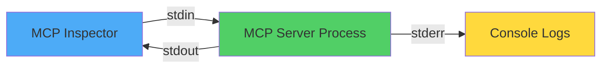
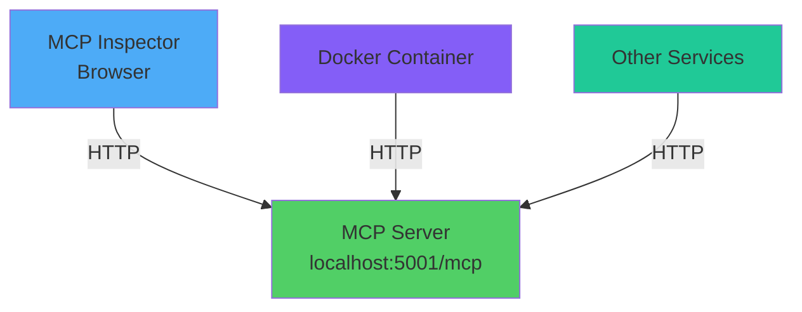
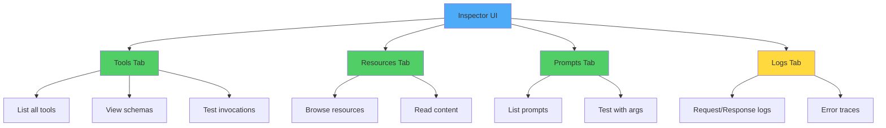
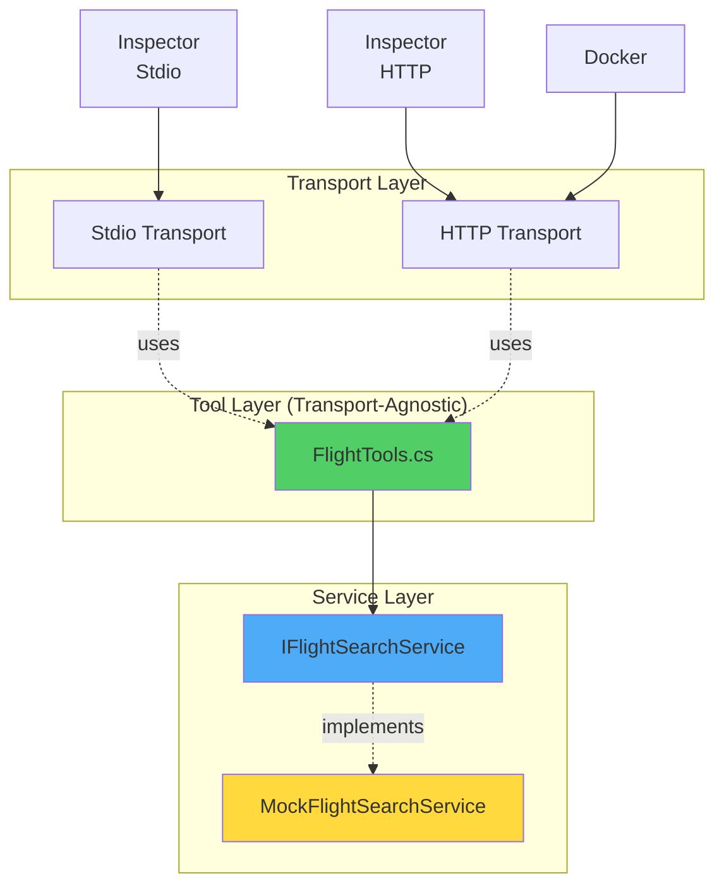
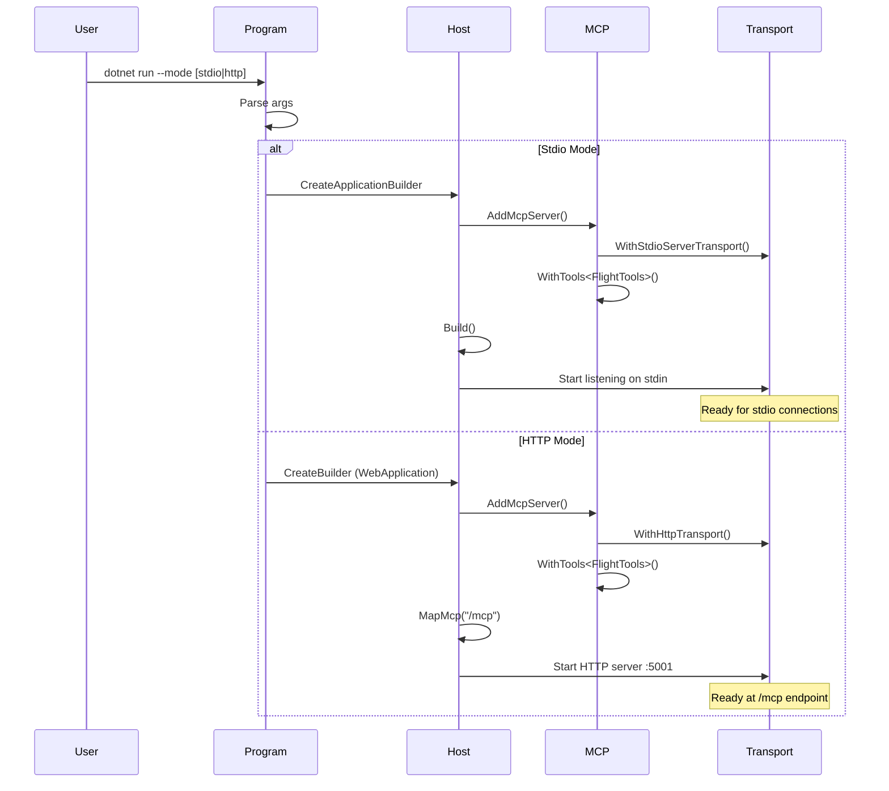
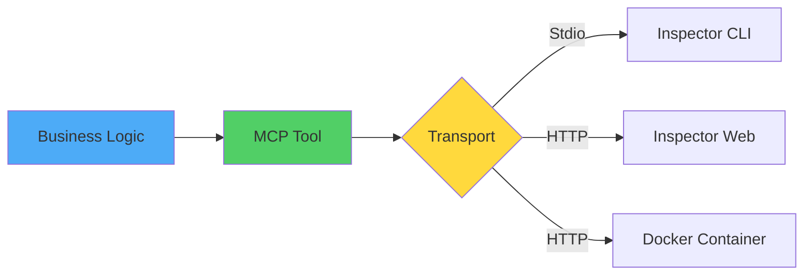

# Chapter 3: Setup Your .NET MCP Workspace - Transports and Inspector

## Overview

This chapter gets you productive with MCP server development by demonstrating **two transport modes** (stdio and HTTP), showing how to connect with the **MCP Inspector** for interactive testing, and providing a complete working MCP server that handles flight searches. The same tool implementation works seamlessly with both transports!

## 📁 Project Structure

```
Chapter03/code/
├── Chapter03.csproj                          # Project configuration (ASP.NET Core)
├── Program.cs                                # Dual-mode server (stdio/HTTP)
├── Shared.cs                                 # Domain models + MockFlightSearchService
├── FlightTools.cs                            # MCP tool (transport-agnostic)
│
├── ch03_1_flights_server_stdio.cs.example    # Original stdio example
└── ch03_2_flights_server_http.cs.example     # Original HTTP example
```

## 🎯 Learning Objectives

- ✅ Configure MCP servers with stdio transport (for Inspector)
- ✅ Configure MCP servers with HTTP transport (for Docker/web)
- ✅ Use MCP Inspector to browse and test capabilities interactively
- ✅ Understand transport-agnostic tool implementation
- ✅ Run local development stacks with proper logging

## 📚 Transport Modes Explained

### Stdio Transport (Section 3.1)

**Purpose**: Direct process-to-process communication via standard input/output streams



**When to Use**:
- ✅ Local development with MCP Inspector
- ✅ Command-line tool integration
- ✅ Single-process deployments
- ✅ Simple testing scenarios

**Characteristics**:
- Process-to-process communication
- No network stack required
- Stdout must remain clean (logs go to stderr)
- Started via `dotnet run`

### HTTP Transport (Section 3.3)

**Purpose**: Network-accessible MCP server via HTTP endpoints



**When to Use**:
- ✅ Docker Compose orchestration
- ✅ Multi-server deployments
- ✅ Web-accessible services
- ✅ Production environments

**Characteristics**:
- Network-accessible endpoints
- Works across container boundaries
- Standard HTTP/SSE protocols
- Supports multiple concurrent clients

## 🚀 Building and Running

### Prerequisites

- **.NET SDK 10.0.201** or later
- **Node.js 18+** (for MCP Inspector)
- **PowerShell** (recommended)
- **Visual Studio 2022+** or .NET CLI

> **IMPORTANT NOTE**: This chapter uses ASP.NET Core (`Microsoft.NET.Sdk.Web`) for HTTP support. The same project can run in both stdio and HTTP modes.

### Quick Start - Stdio Mode

```powershell
# Navigate to project
cd HandsOnMCPCSharp\Chapter03\code

# Build
dotnet build

# Run in stdio mode (default)
dotnet run
```

**Expected Output (Stdio)**:
```
╔════════════════════════════════════════════════════════════════╗
║     Chapter 3 — MCP Server     Main                           ║
╚════════════════════════════════════════════════════════════════╝

Starting MCP server with stdio transport...
Ready for MCP Inspector connection via stdio

info: Application started. Press Ctrl+C to shut down.
```

### Quick Start - HTTP Mode

```powershell
# Run in HTTP mode
dotnet run -- --mode http
```

**Expected Output (HTTP)**:
```
╔════════════════════════════════════════════════════════════════╗
║     Chapter 3 — MCP Server     Main                           ║
╚════════════════════════════════════════════════════════════════╝

Starting MCP server with HTTP transport...
Server will be available at: http://localhost:5001/mcp

✓ HTTP server ready!
  Endpoint: http://localhost:5001/mcp
  Press Ctrl+C to stop
```

### Running Chapter Examples

The original chapter examples are also available as runnable `.cs` files:

```powershell
# Run Section 3.1 example (stdio)
dotnet run -- --example stdio

# Run Section 3.3 example (HTTP)
dotnet run -- --example http
```

> **TIP**: The examples (`--example` flag) demonstrate the exact code from the chapter sections. The main modes (`--mode` flag) provide a cleaner production-ready implementation. Both work identically!

**See `EXAMPLES_GUIDE.md` for details on all 4 running modes.**

## 🛠️ SDK Environment Setup

### MSBuildSDKsPath Configuration

If you encounter SDK path errors:

```powershell
# PowerShell (set once per session)
$env:MSBuildSDKsPath = 'C:\Program Files\dotnet\sdk\10.0.201\Sdks'
dotnet build
dotnet run
```

> **TIP**: See Chapter 1 or Chapter 2 READMEs for permanent PowerShell profile setup instructions.

### Verify Installation

```powershell
# Check SDKs
dotnet --list-sdks

# Should include:
# 10.0.201 [C:\Program Files\dotnet\sdk]
```

## 🔍 Using MCP Inspector

The MCP Inspector is a web-based tool for browsing and testing MCP servers interactively.

### Install MCP Inspector

```powershell
# One-time global install
npm install -g @modelcontextprotocol/inspector

# Or use npx (no install needed)
npx @modelcontextprotocol/inspector --version
```

### Connect to Stdio Server

#### Terminal 1: Start Server
```powershell
cd HandsOnMCPCSharp\Chapter03\code
dotnet run
```

#### Terminal 2: Launch Inspector
```powershell
npx @modelcontextprotocol/inspector dotnet run --project HandsOnMCPCSharp/Chapter03/code
```

**Inspector will**:
1. Start the MCP server process
2. Connect via stdio
3. Open web browser to http://localhost:6000
4. Display server capabilities

### Connect to HTTP Server

#### Terminal 1: Start Server
```powershell
cd HandsOnMCPCSharp\Chapter03\code
dotnet run -- --mode http
```

#### Terminal 2: Launch Inspector
```powershell
npx @modelcontextprotocol/inspector
```

Then in the Inspector UI:
1. Choose "HTTP" connection type
2. Enter URL: `http://localhost:5001/mcp`
3. Click "Connect"

### Inspector Interface Overview



### Testing SearchFlights Tool in Inspector

1. **Navigate to Tools tab**
2. **Find "SearchFlights" tool**
3. **Click to expand schema**
4. **Fill in parameters**:
   ```json
   {
     "origin": "LHR",
     "destination": "JFK",
     "date": "2026-06-15"
   }
   ```
5. **Click "Call Tool"**
6. **View results** in response panel

**Expected Response**:
```json
{
  "flights": [
    {
      "flightId": "FL-LHR-JFK-001",
      "airline": "British Airways",
      "flightNumber": "BA123",
      "departureTime": "2026-06-15T08:30:00Z",
      "arrivalTime": "2026-06-15T11:45:00Z",
      "price": { "amount": 299.99, "currencyCode": "GBP" },
      "seatsAvailable": 45
    },
    // ... more flights
  ],
  "totalResults": 3
}
```

## 📊 Architecture Diagrams

### Transport-Agnostic Tool Implementation



**Key Insight**: The `FlightTools` class is identical for both transports. Only the server configuration in `Program.cs` changes!

### Stdio vs HTTP Comparison

| Aspect | Stdio Transport | HTTP Transport |
|--------|----------------|----------------|
| **Communication** | stdin/stdout streams | HTTP requests |
| **Network** | Not required | Required |
| **Logging** | stderr only (stdout reserved) | Any stream (HTTP separate) |
| **Inspector** | `npx ... dotnet run` | Connect to `http://...` |
| **Docker** | Not suitable (no shared stdio) | ✅ Works across containers |
| **Multi-client** | Single process | ✅ Multiple concurrent |
| **Use Case** | Local dev, CLI tools | Production, web services |

### Server Startup Flow



## 📚 Code Files Explained

### `Shared.cs` - Domain Models & Mock Service

Provides the types and mock implementation for Chapter 3:

```csharp
// Domain Models (from Chapter 1)
FlightOption, Money, FlightSearchResult

// Service Interface
IFlightSearchService

// Mock Implementation
MockFlightSearchService - Returns 3 sample flights
```

> **TIP**: The same mock service from Chapters 1 & 2 is reused. This demonstrates how MCP server development focuses on capability declaration, not business logic changes.

### `FlightTools.cs` - MCP Tool Implementation

The core MCP tool that works with **both** transports:

```csharp
[McpServerToolType]
public class FlightTools(IFlightSearchService flightSearch)
{
    [McpServerTool]
    [Description("Search available flights...")]
    public async Task<FlightSearchResult> SearchFlightsAsync(
        [Description("IATA origin code")] string origin,
        [Description("IATA destination code")] string destination,
        [Description("Departure date (ISO 8601)")] string date,
        CancellationToken ct = default)
    {
        var departureDate = DateOnly.Parse(date);
        return await flightSearch.SearchAsync(origin, destination, departureDate, ct);
    }
}
```

**Why It's Transport-Agnostic**:
- No transport-specific code
- Uses dependency injection (`IFlightSearchService`)
- Returns domain types (`FlightSearchResult`)
- MCP SDK handles JSON-RPC wrapping

### `Program.cs` - Dual-Mode Server

Orchestrates both stdio and HTTP configurations:

**Command Line Arguments**:
- `dotnet run` → stdio mode (default)
- `dotnet run -- --mode stdio` → stdio explicitly
- `dotnet run -- --mode http` → HTTP mode

**Key Configuration Differences**:

```csharp
// Stdio: Use Host builder
var builder = Host.CreateApplicationBuilder(args);
builder.Services.AddMcpServer()
    .WithStdioServerTransport()  // ← Stdio transport
    .WithTools<FlightTools>();

// HTTP: Use WebApplication builder
var builder = WebApplication.CreateBuilder(args);
builder.Services.AddMcpServer()
    .WithHttpTransport()  // ← HTTP transport
    .WithTools<FlightTools>();
var app = builder.Build();
app.MapMcp("/mcp");  // ← Register endpoint
```

> **IMPORTANT NOTE**: In stdio mode, all logging must go to stderr (not stdout) so the JSON-RPC protocol on stdout remains clean. The SDK configures this automatically.

### `.example` Files

The original chapter examples are preserved as reference:

- `ch03_1_flights_server_stdio.cs.example` - Original stdio server
- `ch03_2_flights_server_http.cs.example` - Original HTTP server

These show the "before" structure with top-level statements. The new `Program.cs` combines both in a cleaner architecture.

## 🐛 Troubleshooting

### Build Errors

**Problem**: `error NU1008: PackageReference items cannot define Version`

**Solution**: CPM is disabled for this chapter. Verify:
```xml
<ManagePackageVersionsCentrally>false</ManagePackageVersionsCentrally>
```

---

**Problem**: `Could not resolve SDK "Microsoft.NET.Sdk.Web"`

**Solution**: Ensure .NET 10 SDK is installed:
```powershell
winget install Microsoft.DotNet.SDK.10
dotnet --list-sdks
```

### Runtime Issues - Stdio Mode

**Problem**: Server starts but Inspector can't connect

**Solution**: 
1. Ensure server is running: `dotnet run`
2. Launch Inspector with correct path:
   ```powershell
   npx @modelcontextprotocol/inspector dotnet run --project HandsOnMCPCSharp/Chapter03/code
   ```
3. Check that Inspector starts the server itself (it manages the process)

---

**Problem**: JSON parsing errors in stdio mode

**Solution**: Don't pipe data to stdin manually. Let the Inspector connect and send JSON-RPC messages.

---

**Problem**: Logs appear in JSON stream

**Solution**: Ensure logging goes to stderr:
```csharp
builder.Logging.AddConsole(options =>
    options.LogToStandardErrorThreshold = LogLevel.Trace);
```

### Runtime Issues - HTTP Mode

**Problem**: `Address already in use` error

**Solution**: Port 5001 is in use. Stop other processes:
```powershell
# Find process using port 5001
netstat -ano | findstr :5001

# Stop the process (replace PID)
taskkill /PID <pid> /F

# Or change port in Program.cs
```

---

**Problem**: Inspector shows "Connection refused"

**Solution**:
1. Verify server is running: `dotnet run -- --mode http`
2. Check logs show: `✓ HTTP server ready!`
3. Confirm URL: `http://localhost:5001/mcp`
4. Try browser: navigate to URL (should see JSON-RPC response)

---

**Problem**: CORS errors in Inspector

**Solution**: The MCP SDK handles CORS automatically. If issues persist, check firewall settings.

## 🎓 Key Concepts

### Transport Independence



**Benefits**:
- Write tool logic once
- Deploy to any transport
- Switch transports without code changes
- Test locally, deploy to cloud

### Inspector Workflow

1. **Discovery**: Inspector calls `list_tools()`, `list_resources()`, `list_prompts()`
2. **Schema Review**: Displays auto-generated JSON schemas
3. **Testing**: User fills parameters, clicks "Call"
4. **Validation**: Inspector validates against schema
5. **Invocation**: Sends JSON-RPC request to server
6. **Response**: Displays structured result

### Logging Best Practices

**Stdio Mode**:
```csharp
// ✅ Good: Logs to stderr
builder.Logging.AddConsole(options =>
    options.LogToStandardErrorThreshold = LogLevel.Trace);

// ❌ Bad: Would pollute stdout JSON-RPC stream
Console.WriteLine("Log message");  // Don't do this!
```

**HTTP Mode**:
```csharp
// ✅ Good: Any logging is fine
builder.Logging.AddConsole();
Console.WriteLine("Server starting...");  // OK in HTTP mode
```

## 🔗 Related Resources

### Documentation
- **MCP Specification**: https://spec.modelcontextprotocol.io/
- **MCP Inspector**: https://github.com/modelcontextprotocol/inspector
- **C# SDK Repository**: https://github.com/modelcontextprotocol/csharp-sdk

### Related Chapters
- **Chapter 1**: MCP motivation and comparison
- **Chapter 2**: Tools, resources, prompts fundamentals
- **Chapter 4**: (Next) Production deployment patterns

### Solution-Level Docs
- **Build Guide**: `../../../CHANGES.md`
- **InMemoryTransport Sample**: `../../../samples/InMemoryTransport/README.md`

## 📝 Next Steps

1. ✅ **Completed**: Run MCP server in both transport modes
2. ✅ **Tested**: Use Inspector to browse and test capabilities
3. ➡️ **Next**: Chapter 4 - Production deployment with Docker

```powershell
cd ..\Chapter04\code
dotnet build
dotnet run
```

### Exercises

Before moving on, try these exercises:

1. **Add a New Tool**: Create a `GetAirportInfo` tool that returns airport details
2. **Test Both Transports**: Run the same tool in stdio and HTTP mode
3. **Inspector Exploration**: Browse all tabs (Tools, Resources, Prompts, Logs)
4. **Error Handling**: Test tool with invalid parameters (e.g., bad date format)
5. **Logging**: Watch stderr logs in stdio mode vs HTTP mode

---

**Last Updated**: March 30, 2026  
**SDK Version**: .NET 10.0.201  
**MCP SDK**: Local project reference (latest)  
**Status**: ✅ Dual-mode server (stdio + HTTP) fully functional

### Docker Compose (multi-server stack)

```bash
docker compose up
```

See `docker-compose.yml` in the repository root for the full multi-server configuration.

## Prerequisites

- .NET 9 SDK
- Node.js 18+ (for MCP Inspector via `npx`)
- Docker Desktop (for the Docker Compose stack)

## Further reading

- MCP Inspector: https://github.com/modelcontextprotocol/inspector
- MCP C# SDK quickstart: https://modelcontextprotocol.io/docs/develop/build-server#c%23
